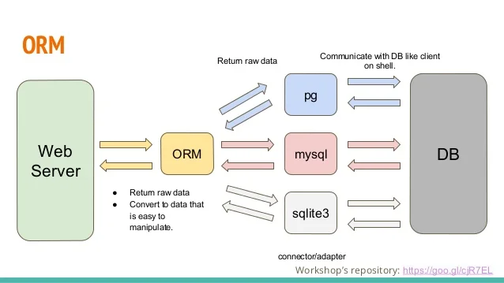
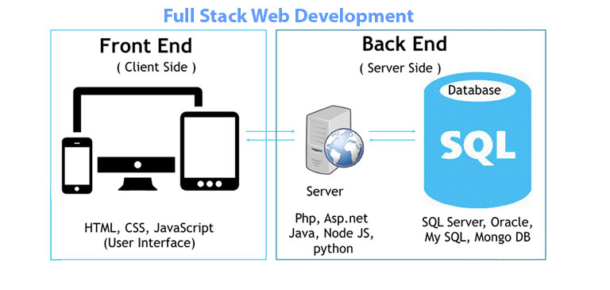
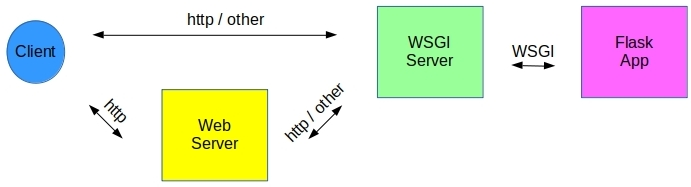
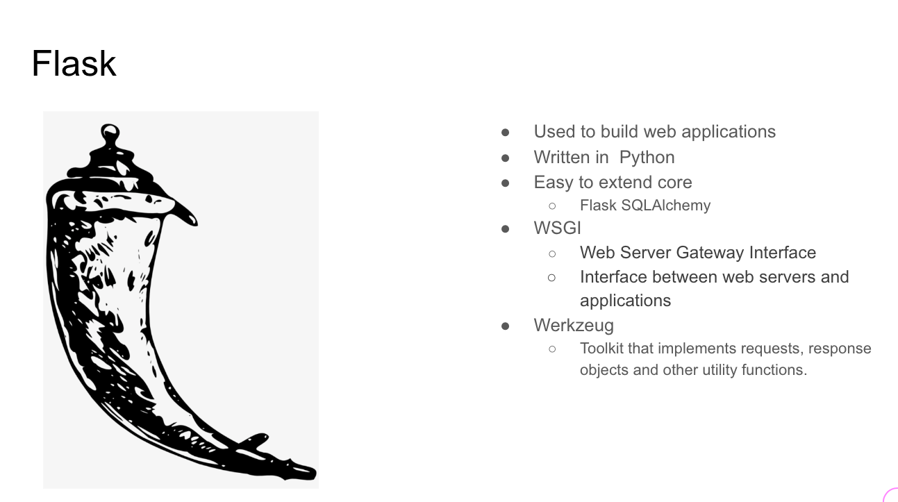

## Introduction to Flask

---

#### The backend we built in Phase 3

With SQLAlchemy as our ORM, we built the above, except instead of a Web Server, we scripted a CLI application to interact with our ORM.

---

##### Our goal: Full-Stack Applications!

We still need something like `json-server` which can bridge the gap between front and back end and complete the **Request-Response Cycle**

---

#### We need some WSGI in our Flask 🍹

The **Web Server Gateway Interface** provided by **Werkzeug** will be able to handle the HTTP traffic to our web server.

---

<section data-background-color="mistyrose">
    
    
Although our server app will focus on requests for dynamic resources--database records--our app could also route requests for static resources, such as images, to an entirely different server.

</section>

---

#### Let's code! {.fragment}