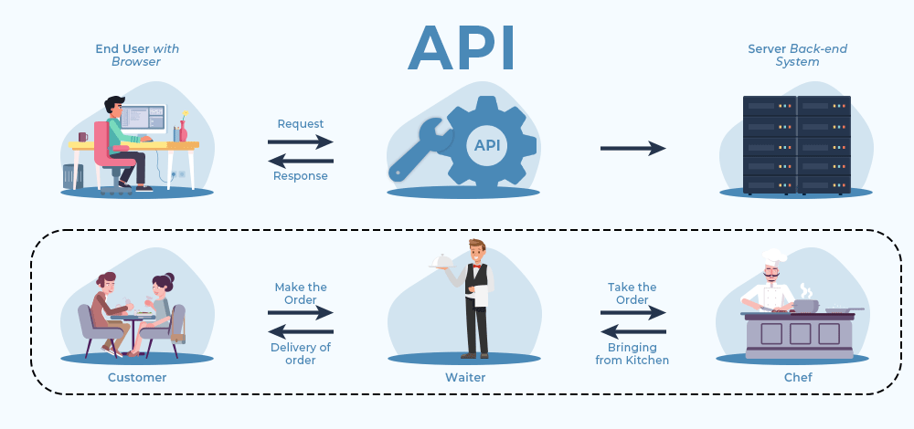

## REST APIs with Flask (Part 1)

---

## Learning Objectives
- Review API Fundamentals
- Discuss MVC Architecture and Reinforce Patterns / Best Practices
- Introduce RESTful Routing
- Build and Execute GET / POST Requests
- Introduce and Use Postman to Interact with APIs
- Discuss the Importance of Serializers
- Observe How to Properly Set Up Serializers
- Understand How to Use Serializers to Render Structured Data in API Responses

---

.png)

---

#### But more specific to our context...

---

<section data-background-color="mistyrose">

#### Endpoints ARE our interface

</section>

---

#### How does this help with MVC?

---

Does this remind you of React state and rerenders?

---

### What and Why of REST

---

### The Non-SPA Version

---

### The SPA Version of REST

---

### Status Codes

* [HTTP Cats](https://http.cat/)
* [HTTP Status Dogs](https://httpstatusdogs.com/)

---

### Flask-SQLAlchemy One-to-Many

---

### Anatomy of a Relationship

