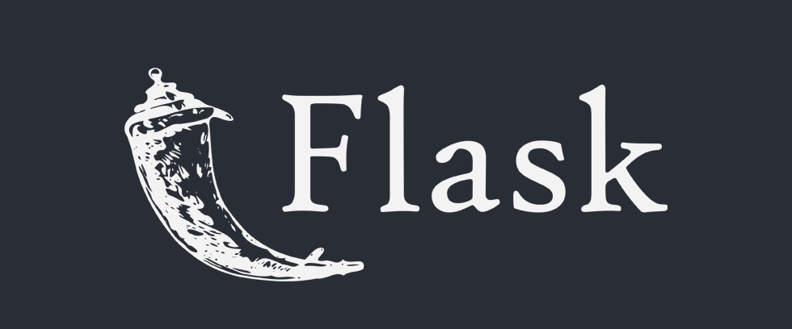

## REST APIs with Flask (Part 1)

---

## Learning Objectives
- Review API Fundamentals
- Discuss MVC Architecture and Reinforce Patterns / Best Practices
- Introduce RESTful Routing
- Build and Execute GET / POST Requests
- Introduce and Use Postman to Interact with APIs
- Discuss the Importance of Serializers
- Observe How to Properly Set Up Serializers
- Understand How to Use Serializers to Render Structured Data in API Responses

---

