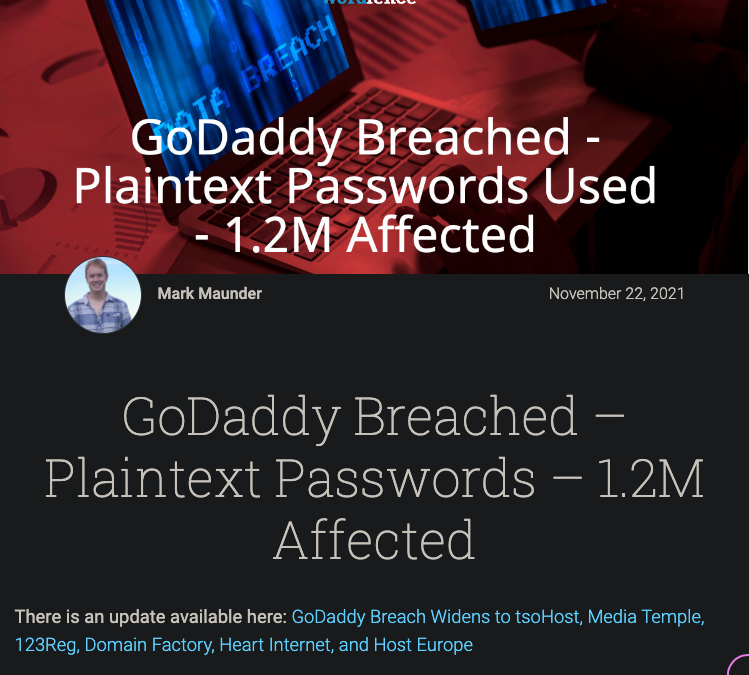
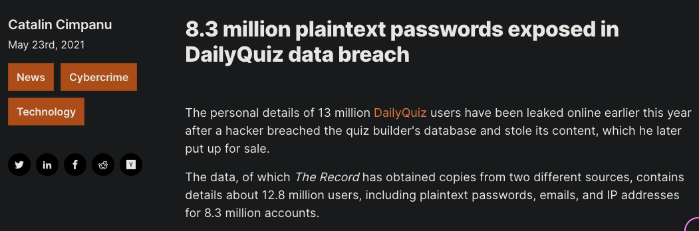
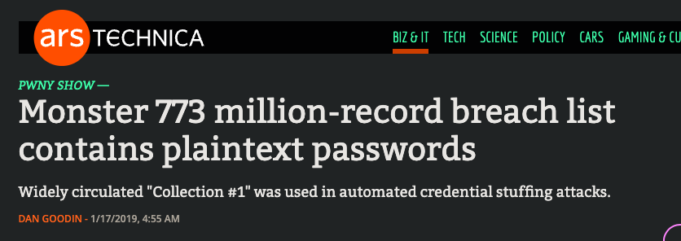
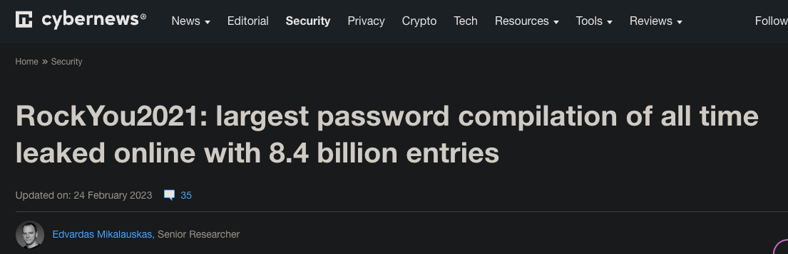

## Authorization with Flask

---

## Learning Objectives
* Understand the dangers of plaintext passwords {.fragment .fade-up}
* Understand the concept of hashing {.fragment .fade-up}
* Differentiate between hashing and encryption {.fragment .fade-up}
* Know about rainbow tables {.fragment .fade-up}
* Understand the concept of salting {.fragment .fade-up}
* Be able to use the `bcrypt` library to hash passwords {.fragment .fade-up}

---

### 🚫 Storing Passwords as Plaintext is BAD 🚫

---

### Some breaches are bigger than others

 

 {.fragment .fade-up}

---

### Even the big companies get it wrong

---

### Hackers are paying attention

---

### Protecting Passwords with Hashing

---

### Hashing vs Encryption

---

### Hashing alone is not enough

---

### Salting

---

### Salting with `bcrypt`
 

#### Let's dive into the code! 🤿 {.fragment .fade-up}

